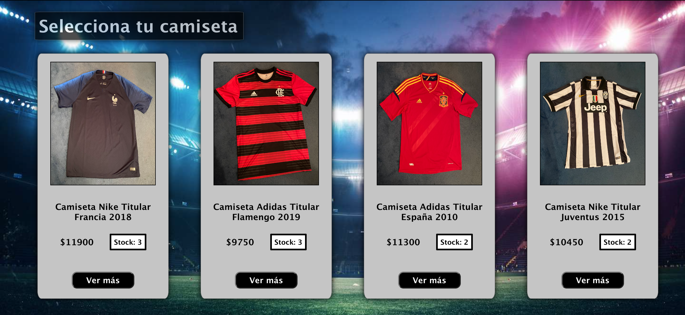
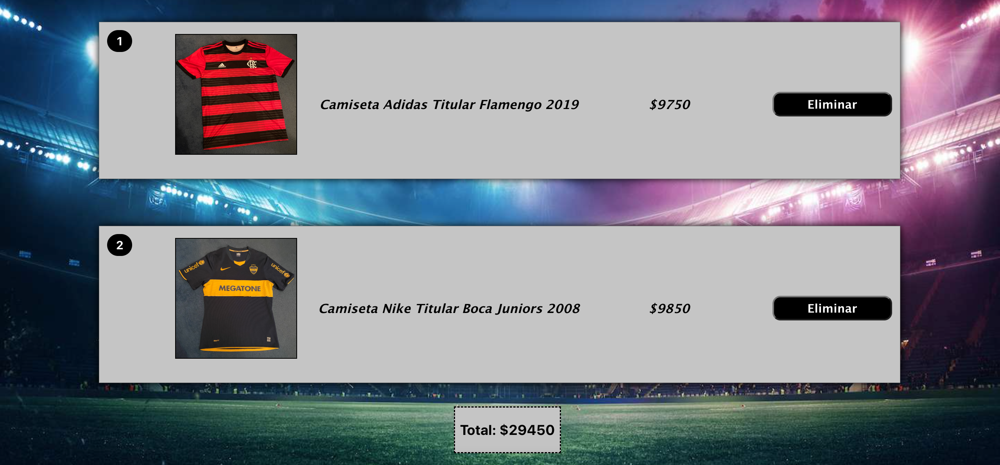

# MiCamiseta

Es una aplicación para comercializar productos deportivos, específicamente camisetas de futbol. Generada con el framework de Javascript conocido como React, en ella se destacan la reutilización de componentes, la implementación de hooks y la ejecución de diversas funcionalidades y configuraciones de navegación, las cuales otorgan al cliente la posibilidad de ejecutar la búsqueda y el proceso de compra de uno o varios productos. 


## Instalación

Para obtener un entorno de desarrollo ejecutándose, se debe: 

1. Clonar el repositiorio proporcionando la dirección URL del mismo.
2. Instalar los modulos externos ejecutando el comando npm install en la consola. 
3. Finalmente, implementar el comando npm start para ejecutar la aplicación.


## Componentes

Estos son los principales componentes que permiten una gran comprensión y mantenimiento de la presente aplicación:

* **ItemListContainer**. Componente contenedor que, al llamar a la colección de datos ubicada en la plataforma Firebase, renderiza todos los productos, o bien, según su categoría a través de la implementación de queries. 



* **ItemDetailContainer**. Componente contenedor que, al llamar a la colección de datos con el id como parámetro, renderiza el detalle de un producto en particular. 


* **ItemCount**. Componente funcional en el cual el uso de diversas funciones permiten registrar en el carro de compras la cantidad de productos elegidos por el cliente.


* **Cart**. Componente que visualiza el valor y la cantidad total de los productos seleccionados por el cliente.



* **Checkout**. Componente que muestra la efectivización de la compra, en el cual el uso de una variedad de funciones permiten registrar tanto los datos del cliente como la orden de dicha operación realizada.


## Funcionalidades 

Estos son los principales métodos establecidos que permiten una mayor optimización del funcionamiento de la aplicación: 

* `getProducts()` devuelve la colección de productos requeridos y el filtrado según la categoría de los mismos.
```
function getProducts(category) {
    const db = getFirestore();
    const itemCollection = collection(db, 'items');
    const q = category && query(itemCollection, where('category', '==', category));
    return getDocs(q || itemCollection);
}
```

* `getItem()` devuelve la data de un solo producto mediante el parámetro id.
```
function getItem(id) {
    const db = getFirestore();
    const itemReference = doc(db, 'items', id);
    return getDoc(itemReference);
}
```

* `addItem()` permite al cliente registrar el producto que seleccionó en el carro de compras. 
```
const [productList, setProductList] = useState([]);
const isInCart = (id) => {
    return productList.some(item => item.id === id)
}
const addItem = (item, quantity) => {
    if(isInCart(item.id)) {
        setProductList(productList.map((product) => product.id === item.id ? {...product, quantity: product.quantity + quantity} : product))
    }
    setProductList([...productList, {...item, quantity}])
}
```

* `removeItem()` permite al cliente eliminar un producto del carro de compras.
```
const [productList, setProductList] = useState([]);
const removeItem = (id) => {
    setProductList(productList.filter(item => item.id !== id));
}
```

* `totalItems()` devuelve la cantidad total de productos seleccionados, permitiéndole al cliente visualizarla en el Widget del carrito ubicado en la barra de navegación. 
```
const [productList, setProductList] = useState([]);
const totalItems = () => {
        return productList.reduce((total, item) => total + item.quantity, 0)
    }
```

* `totalPrice()` devuelve el precio total de la sumatoria de los productos seleccionados.
```
const totalPrice = () => {
        return productList.reduce((total, item) => total + item.quantity * item.price, 0)
    }
```

* `generatingOrder()` permite crear una nueva colección (en este caso de ordenes de compra), generar un nuevo id por cada orden y, una vez realizado el proceso de compra, vaciar el carrito mediante la función clear() -consumida del contexto de la aplicación-. Ésta recibirá como parámetro la data (la cual incluye información del cliente, del producto y de la compra en cuestión) para que, una vez que el cliente haya completado el formulario y, por consiguiente, finalice la operación, quede registrada en la nueva colección. 
```
const { productList, totalPrice, clear } = useContext(CartContext)
const [loading, setLoading] = useState(false); 
const [orderId, setOrderId] = useState();
const generatingOrder = async(data) => {
    setLoading(true);
    try {
        const db = getFirestore();
        const itemCollection = collection(db, 'Orders');
        const order = await addDoc(itemCollection, data);
        setOrderId(order.id);
        clear();
        setLoading(false);
    } catch (error) {
        console.log(error)
    }
}
const handlerSubmit = (element) => {
    element.preventDefault();
    const items = productList.map(element => { 
        return { 
            id: element.id, 
            title: element.title, 
            price: element.price, 
            quantity: element.quantity 
        }});
    const date = new Date();
    const total = totalPrice();
    const data = { buyer, items, date, total};
    console.log('data', data);
    generatingOrder(data);
}
```

## Herramientas 

* ReactJS
* Firebase


## Autor

* Brian Gabriel Catrini
